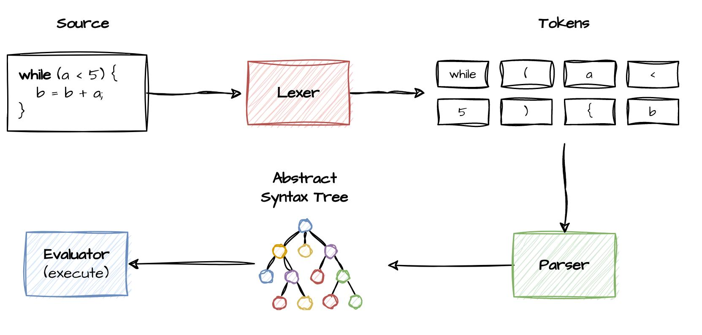

# PyLox 


## What's this 

This is the Python implementation of an intepreter for [Lox](https://craftinginterpreters.com/the-lox-language.html), a JavaScript-inspired high level language with dynamic typing and automatic memory management. Lox is also an object-oriented language, though I might stop at implementing a struct-like data type without inheritance support.

```kotlin
fun fibonacci(x) {
    if (x <= 1) {
        return 1;
    }

    return fibonacci(x + 1) + fibonacci(x + 2);
}

var a = 10;
var b;
var c;
while (a > 5) {
    for (b = 0; b < a; b = b + 1) {
        c += a * b;
    }
    a = a - 1;
}
```

## Implementation status:



- [x] Lexer 
- [ ] Expression 
  - [x] Parser 
  - [x] Evaluator
- [ ] Statements 
  - [ ] Parser
  - [ ] Evaluator 
- [ ] OOP  
- [ ] Additional features
  - [ ] Macros
  - [ ] Import external `lox` files
  - [ ] Python interop
